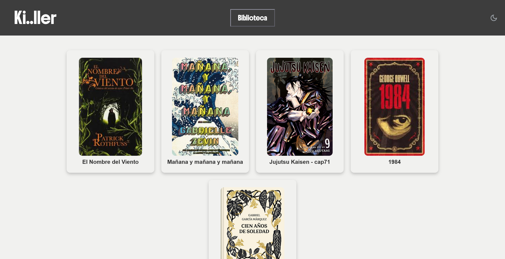
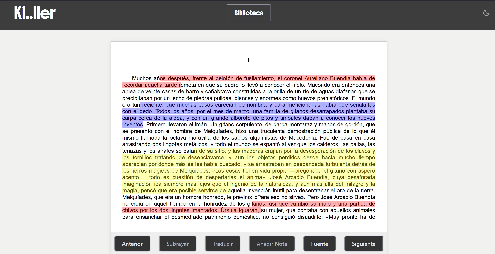

# Integrantes del Grupo

Sonia Navas Rutete @SoniaUC3M 100472180

David Sánchez Arranz @100460314 100460314

Javier Sanz Díaz @habie2 100472296

# Ki..ller App

Este proyecto crea un servidor a modo de libro electrónico y permite que se conecte un cliente para el control remoto del libro mediante comandos de voz, gestos y controles. También permite interactuar con el libro y hacer distintas anotaciones.





## Cómo iniciar

1. Asegúrate de tener Node.js instalado.
2. Ejecuta el servidor:

```bash
node server.js
```

3. La interfaz kindle se encontrará en `https://localhost:3000/kindle/` y la interfaz del móvil en `https://localhost:3000/phone/`
